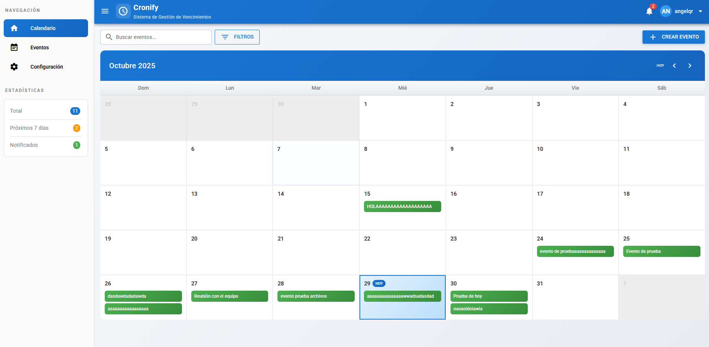
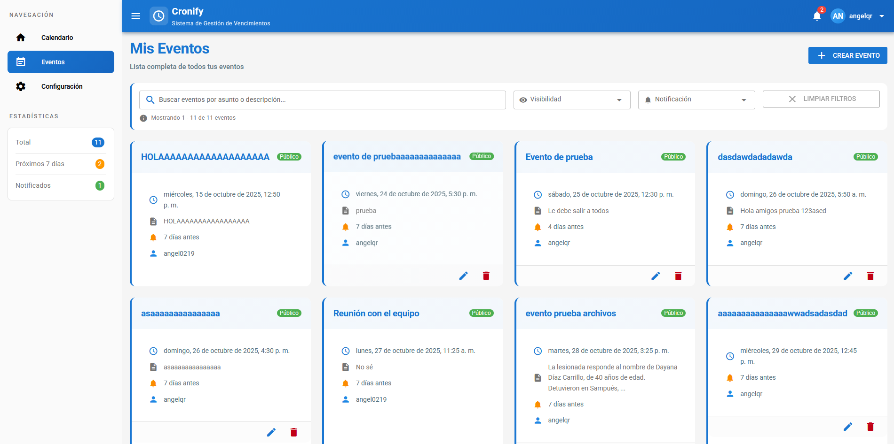
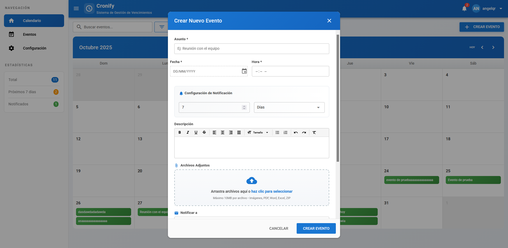
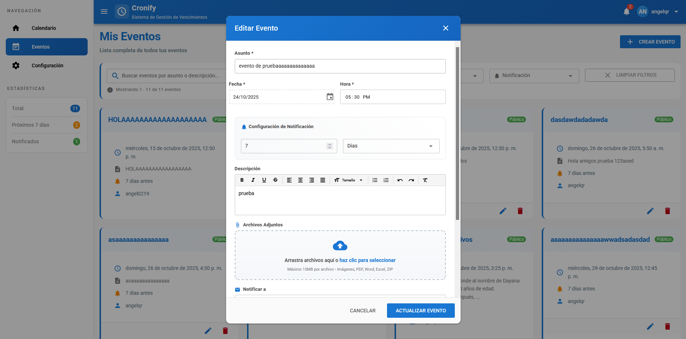
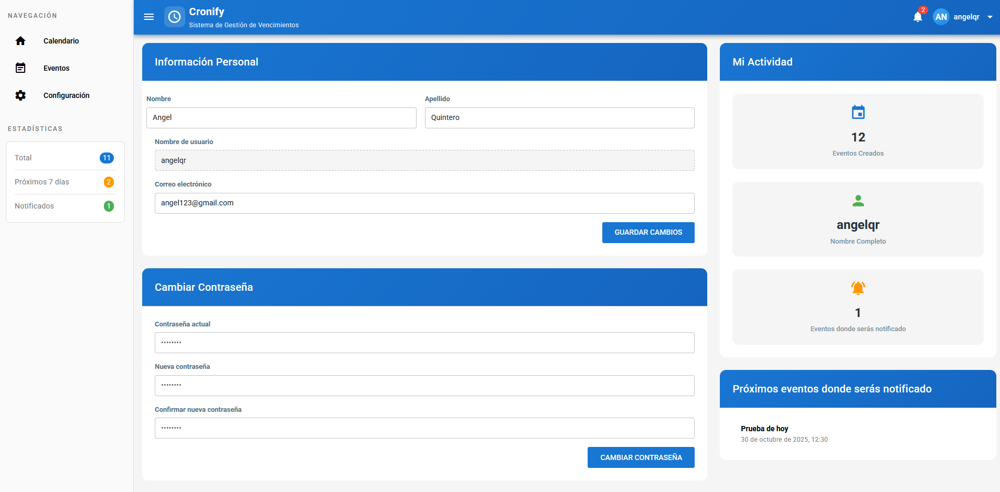
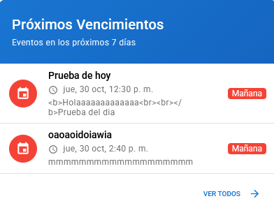

# Cronify - Sistema de Gestión de Vencimientos

Sistema web integral para la gestión, seguimiento y notificación proactiva de vencimientos de eventos y actividades críticas.

<div align="center">


</div>

---

## Tabla de Contenidos

1. [Características](#características)
2. [Capturas de Pantalla](#capturas-de-pantalla)
3. [Tecnologías](#tecnologías)
4. [Requisitos Previos](#requisitos-previos)
5. [Instalación](#instalación)
    - [Backend (Django)](#backend-django)
    - [Frontend (Vue + Quasar)](#frontend-vue--quasar)
6. [Configuración](#configuración)
    - [Microsoft OAuth y Graph API](#microsoft-oauth-y-graph-api)
    - [Pruebas sin Azure](#pruebas-sin-azure)
7. [Ejecución](#ejecución)
8. [API Endpoints](#api-endpoints)
9. [Estructura del Proyecto](#estructura-del-proyecto)
10. [Características Técnicas](#características-técnicas)
11. [Validaciones](#validaciones)
12. [Resumen de Cambios](#resumen-de-cambios)
13. [Preguntas Frecuentes](#preguntas-frecuentes)
14. [Contribuir](#contribuir)
15. [Licencia](#licencia)

---

## Características

### Funcionalidades Principales

- **Gestión Completa de Eventos**
  - Crear, editar, eliminar y visualizar eventos
  - Calendario interactivo con vista mensual
  - Lista de eventos con paginación (20 por página)
  - Vista de detalle completa de eventos

- **Sistema de Notificaciones**
  - Notificaciones automáticas por correo electrónico
  - Configuración personalizada (minutos, horas, días, semanas)
  - Notificaciones en tiempo real en el header
  - Programación automática con Celery Beat (8:00 AM diario)

- **Búsqueda y Filtros Avanzados**
  - Búsqueda instantánea con debounce (500ms)
  - Filtros por fecha, creador, estado de notificación
  - Búsqueda en asunto y descripción

- **Autenticación y Seguridad**
  - Autenticación JWT (tokens de 24 horas)
  - Login con Microsoft OAuth (Outlook/Hotmail)
  - Registro tradicional (usuario/contraseña)
  - Perfil de usuario con estadísticas
  - Cambio de contraseña
  - Permisos granulares (solo el creador puede editar/eliminar)

- **Archivos Adjuntos**
  - Subida múltiple con drag & drop
  - Validación: 10MB por archivo, 50MB por evento
  - Soporte para PDF, imágenes, documentos
  - Descarga directa de archivos

- **Interfaz Moderna**
  - Diseño Material Design (Quasar Framework)
  - Gradiente azul profesional (#1976d2 → #1565c0)
  - Transiciones suaves y animaciones
  - Responsive design (móvil, tablet, desktop)
  - Estados de hover interactivos

- **Seguridad**
  - Soft delete (eliminación lógica)
  - Validaciones robustas en frontend y backend
  - Protección CSRF
  - Variables de entorno para secretos

---

## Capturas de Pantalla

<div align="center">






</div>

---

## Tecnologías

**Backend:**
- Django 5.1.1
- Django REST Framework 3.15.2
- PostgreSQL 16
- JWT + Microsoft OAuth 2.0
- Celery 5.4.0 + Redis 5.0.8
- Microsoft Graph API (Outlook)
- MSAL + Django Allauth
- python-decouple

**Frontend:**
- Vue 3 (Composition API)
- Quasar 2.18.5
- Vite
- Axios
- Pinia
- Vue Router 4
- date-fns

**DevOps y Herramientas:**
- Git
- pip, npm
- ESLint, Pylint, Black

---

## Requisitos Previos

**Backend:**
- Python 3.11 o superior
- PostgreSQL 14+ (puerto 5432)
- Redis 5.0+ (para Celery)
- pip

**Frontend:**
- Node.js 18+ (recomendado v18 LTS)
- npm 9+ o yarn 1.22+

**Opcional:**
- Git
- Cuenta de Microsoft Azure (para OAuth y Graph API)
- Cuenta de Outlook/Microsoft (para envío de correos)

---

## Instalación

**NOTA:** El sistema incluye autenticación con Microsoft OAuth y envío de correos mediante Microsoft Graph API. Consulta `CONFIGURACION_MICROSOFT.md` para configuración completa.

### Backend (Django)

**1. Clonar el Repositorio**
```bash
git clone https://github.com/tuusuario/cronify.git
cd cronify
```

**2. Crear Entorno Virtual**
```bash
cd backend
python -m venv venv

# Windows
venv\Scripts\activate

# Linux/Mac
source venv/bin/activate
```

**3. Instalar Dependencias**
```bash
pip install -r requirements.txt
```

**4. Configurar Base de Datos PostgreSQL**

Usando psql:
```bash
psql -U postgres
CREATE DATABASE cronify_db;
CREATE USER cronify_user WITH PASSWORD 'tu_password';
GRANT ALL PRIVILEGES ON DATABASE cronify_db TO cronify_user;
\q
```

O usando pgAdmin: crea una base de datos llamada `cronify_db` con encoding UTF8.

**5. Configurar Variables de Entorno**

Crea un archivo `.env` en `backend/`:

```env
# Django
SECRET_KEY=tu-clave-secreta-super-segura-aqui
DEBUG=True
ALLOWED_HOSTS=localhost,127.0.0.1

# Database
DB_NAME=cronify_db
DB_USER=postgres
DB_PASSWORD=tu_password_postgres
DB_HOST=localhost
DB_PORT=5432

# Email Configuration (Gmail)
EMAIL_HOST_USER=tu_email@gmail.com
EMAIL_HOST_PASSWORD=tu_app_password_de_gmail
DEFAULT_FROM_EMAIL=tu_email@gmail.com

# Redis (para Celery)
CELERY_BROKER_URL=redis://localhost:6379/0
CELERY_RESULT_BACKEND=redis://localhost:6379/0
```

**6. Aplicar Migraciones**
```bash
python manage.py migrate
```

**7. Crear Superusuario**
```bash
python manage.py createsuperuser
```

---

### Frontend (Vue + Quasar)

**1. Ir a la Carpeta Frontend**
```bash
cd ../frontend
```

**2. Instalar Dependencias**
```bash
npm install
```

**3. Configurar Variables de Entorno**

Crea un archivo `.env` en `frontend/`:

```env
VITE_API_BASE_URL=http://localhost:8000/api
VITE_APP_TITLE=Cronify
```

---

## Configuración

### Microsoft OAuth y Graph API

Para habilitar el inicio de sesión con Microsoft y el envío de correos vía Outlook/Graph API:

1. Registra una aplicación en Azure (Azure Active Directory > App registrations > New registration)
2. Otorga permisos: `User.Read`, `Mail.Send`, `offline_access`
3. Añade las credenciales en `backend/.env`:

```env
USE_MICROSOFT_GRAPH=True
MICROSOFT_CLIENT_ID=tu_client_id
MICROSOFT_CLIENT_SECRET=tu_client_secret
MICROSOFT_TENANT_ID=common
MICROSOFT_AUTHORITY=https://login.microsoftonline.com/common
MICROSOFT_REDIRECT_URI=http://localhost:8000/api/auth/microsoft/callback/
EMAIL_HOST_USER=tu_email@outlook.com
DEFAULT_FROM_EMAIL=tu_email@outlook.com
```

Ejecuta `python verificar_configuracion_microsoft.py` para validar la integración.

### Pruebas sin Azure

Puedes probar el sistema sin configurar Microsoft OAuth. El login y registro tradicional funcionan normalmente. Los endpoints de Microsoft devolverán error si no hay credenciales, pero el sistema sigue operativo.

---

## Ejecución

### Modo Completo (Recomendado)

Abre cuatro terminales independientes:

**Terminal 1 - Backend Django:**
```bash
cd backend
venv\Scripts\activate
python manage.py runserver
```
Acceso: http://localhost:8000

**Terminal 2 - Celery Worker:**
```bash
cd backend
venv\Scripts\activate
celery -A cronify_backend worker -l info
```

**Terminal 3 - Celery Beat (Scheduler):**
```bash
cd backend
venv\Scripts\activate
celery -A cronify_backend beat -l info
```

**Terminal 4 - Frontend Quasar:**
```bash
cd frontend
npm run dev
```
Acceso: http://localhost:9000

### Modo Simple (Sin Notificaciones)

**Terminal 1 - Backend:**
```bash
cd backend
venv\Scripts\activate
python manage.py runserver
```

**Terminal 2 - Frontend:**
```bash
cd frontend
npm run dev
```

---

## API Endpoints

**Base URL:**
```
http://localhost:8000/api
```

### Autenticación

| Método | Endpoint | Descripción | Requiere Auth |
|--------|----------|-------------|---------------|
| POST   | /auth/register/      | Registrar usuario         | No  |
| POST   | /token/              | Login (obtener JWT)       | No  |
| POST   | /token/refresh/      | Refrescar token           | No  |
| GET    | /auth/profile/       | Ver perfil                | Sí  |
| PUT    | /auth/profile/       | Actualizar perfil         | Sí  |
| POST   | /auth/change-password/| Cambiar contraseña       | Sí  |

### Eventos

| Método | Endpoint | Descripción | Requiere Auth |
|--------|----------|-------------|---------------|
| GET    | /eventos/                 | Listar eventos (con filtros) | Sí |
| POST   | /eventos/                 | Crear evento                 | Sí |
| GET    | /eventos/{id}/            | Ver evento específico        | Sí |
| PUT    | /eventos/{id}/            | Actualizar evento completo   | Sí |
| PATCH  | /eventos/{id}/            | Actualizar evento parcial    | Sí |
| DELETE | /eventos/{id}/            | Eliminar evento (soft delete)| Sí |
| POST   | /eventos/{id}/upload_file/| Subir archivo adjunto        | Sí |

### Usuarios

| Método | Endpoint | Descripción | Requiere Auth |
|--------|----------|-------------|---------------|
| GET    | /usuarios/ | Listar usuarios (para notificar) | Sí |

### Parámetros de Filtrado

**Búsqueda:**
```
GET /api/eventos/?search=reunión
```

**Filtros:**
```
GET /api/eventos/?fecha_desde=2025-10-01&fecha_hasta=2025-10-31
GET /api/eventos/?creador=1
GET /api/eventos/?notificacion_enviada=false
GET /api/eventos/?es_publico=true
```

**Paginación:**
```
GET /api/eventos/?page=2
```

**Ejemplo Completo:**
```
GET /api/eventos/?search=licencia&notificacion_enviada=false&page=1
```

### Formato de Respuesta

**Éxito (200 OK):**
```json
{
  "count": 25,
  "results": [...]
}
```

**Error (400 Bad Request):**
```json
{
  "asunto": ["Este campo es requerido."],
  "fecha_vencimiento": ["La fecha debe ser futura."]
}
```

---

## Estructura del Proyecto

```
Cronify/
│
├── backend/                  # Backend Django
│   ├── cronify_backend/      # Configuración principal
│   ├── users/                # App de usuarios
│   ├── records/              # App de eventos y archivos
│   ├── notifications/        # App de notificaciones
│   ├── media/                # Archivos adjuntos
│   └── docs/                 # Documentación
├── frontend/                 # Frontend Vue + Quasar
│   ├── src/                  # Código fuente
│   ├── public/               # Recursos estáticos
│   └── ...
├── screenshots/              # Capturas de pantalla
└── README.md                 # Documentación principal
```

---

## Características Técnicas

- Arquitectura desacoplada: backend y frontend independientes.
- API RESTful documentada y versionada.
- Seguridad: autenticación robusta, permisos granulares, protección CSRF y CORS.
- Tareas asíncronas y notificaciones programadas.
- Gestión eficiente de archivos adjuntos.
- Código limpio, validaciones exhaustivas y buenas prácticas de desarrollo.

---

## Validaciones

El sistema valida todos los campos críticos: fechas, archivos, permisos, unicidad de usuarios y más. Los mensajes de error son claros y orientados a la acción.

---

## Resumen de Cambios

Consulta el historial de cambios en el repositorio para detalles sobre nuevas funciones, correcciones y mejoras.

---

## Preguntas Frecuentes

- ¿Puedo usar el sistema sin Microsoft OAuth? Sí, el login tradicional está disponible.
- ¿Qué pasa si no configuro el correo? Las notificaciones automáticas no se enviarán, pero el resto del sistema funciona.
- ¿Puedo usar otra base de datos? El sistema está optimizado para PostgreSQL, pero puedes adaptar la configuración.

---

## Contribuir

¿Quieres colaborar? Haz un fork, crea una rama y envía tu pull request. Toda contribución es bienvenida.

**Guía de estilo:**

*Backend (Python):* PEP 8, docstrings, type hints cuando sea posible.

*Frontend (JavaScript/Vue):* ESLint, Composition API, componentes en PascalCase.

---

## Licencia

MIT. Consulta el archivo LICENSE para más detalles.

---

## Autor

Ángel Quintero  
GitHub: [@angeldqr](https://github.com/angeldqr)  
Email: angelquinteror102@gmail.com

---

## Soporte

¿Tienes dudas o encontraste un bug?

1. Abre un [Issue](https://github.com/angeldqr/cronify/issues)
2. Consulta la documentación en `backend/docs/`
3. Contacta al autor

---

